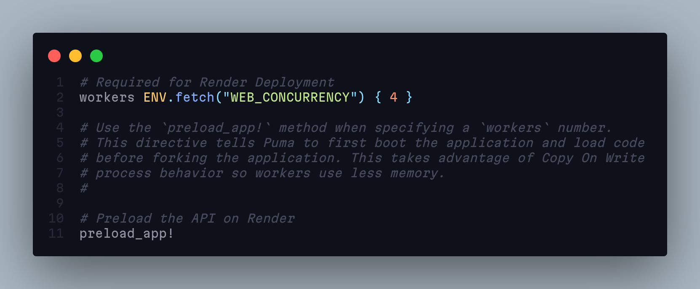
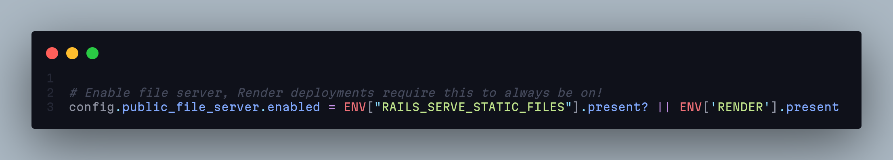

# <strong> Rails API Template Repository </strong>

<h2> A template repository for rails API projects, configured with deployment options for <a href='railway.app'>railway.app</a>. </h2>

## Gems

* `active_model_serializer` to format the json responses.
* `pg` production gem for provisioning a postgres database.
* `foreman` optional gem that will allow deployment of a react app as a client side for the API.

## Configuration

* The template sets a fake asset pipeline for the Railway deployment in <strong>`lib/assets/tasks/fake-assets`</strong>.
* In the `database.yml` file, sets the url for the database to use an env variable and the postgres adapter.
* In the `production.rb` and `development.rb` files, sets the application hosts
* Adds a `Procfile` with web starting options.

## Render Deployment Configuration

#### Credentials

Generate master.key using :

    rails credentials:edit

This will be needed in deployment as the **RAILS_MASTER_KEY** variable

#### Database Adapter

Render uses postgres for deployment, in [database.yml](./config/database.yml) change the production database adapter to

    postgresql

#### Puma / Server Config

In [Puma.rb](./config/puma.rb),

    uncomment preload_app!
    uncomment web_concurrency config

line 2 & line 11 should be uncommented, if they are commented out.

#### Production.rb Config

Make sure that the File server is Always on for the Render deployment.

